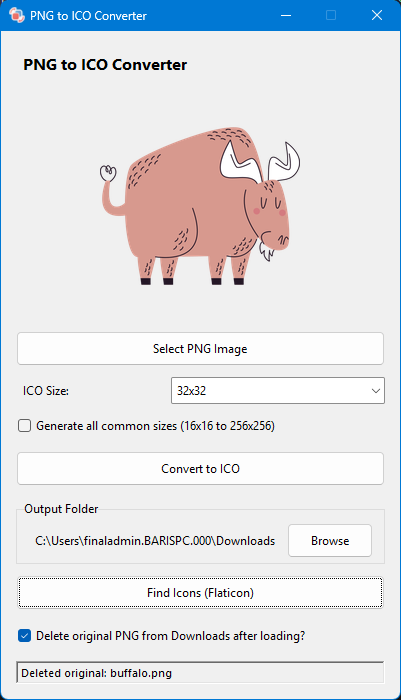

# PNG to ICO Converter

A modern, user-friendly Windows application to convert PNG images to ICO (icon) format with multiple size options.



## Features

- 🖼️ **Simple GUI Interface** - Easy-to-use graphical interface built with Tkinter
- 📐 **Multiple Icon Sizes** - Choose from 16x16 to 256x256 or generate all sizes at once
- 🔄 **Auto-detection** - Automatically detects new PNG files in Downloads folder
- 🗑️ **Auto-delete Option** - Optionally delete original PNG after loading
- 📁 **Custom Output Folder** - Choose where to save your ICO files
- 🎨 **Live Preview** - Preview your image before conversion
- 🌐 **Flaticon Integration** - Quick access to Flaticon for downloading icons
- 🎭 **Modern Theme** - Uses ThemedTk for a sleek, modern appearance

## Installation

### Option 1: Download Standalone Executable (Recommended)

1. Download the latest `pngtoico-v1.0.0-windows.zip` file from the [Releases](../../releases) page
2. Extract the ZIP file
3. Run `PngToIco.exe` - No Python installation required!

### Option 2: Run from Source

1. Clone this repository:
```bash
git clone https://github.com/b-elci/pngtoico.git
cd pngtoico
```

2. Create a virtual environment and install dependencies:
```bash
python -m venv .venv
.venv\Scripts\activate
pip install -r requirements.txt
```

3. Run the application:
```bash
python pngtoico.py
```

## Requirements

- Python 3.7+
- Pillow (PIL)
- ttkthemes (optional, for modern UI theme)

## Usage

1. **Select PNG Image**: Click "Select PNG Image" button or simply download a PNG to your Downloads folder
2. **Choose Size**: Select the desired ICO size from the dropdown (or check "Generate all common sizes")
3. **Convert**: Click "Convert to ICO" button
4. **Output**: Find your ICO file in the selected output folder (default: Downloads)

## Building from Source

To create a standalone executable:

```bash
pip install pyinstaller
pyinstaller --onefile --windowed --icon=icon.ico --add-data "icon.ico;." pngtoico.py
```

The executable will be in the `dist` folder.

## Developer

**Barış Elçi**

## License

This project is licensed under the MIT License - see the LICENSE file for details.

## Acknowledgments

- Built with [Pillow](https://python-pillow.org/) for image processing
- UI powered by [ttkthemes](https://ttkthemes.readthedocs.io/)
- Icons can be found at [Flaticon](https://www.flaticon.com/)
